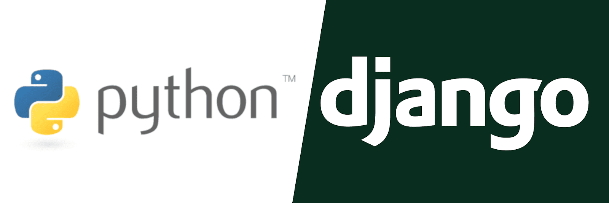
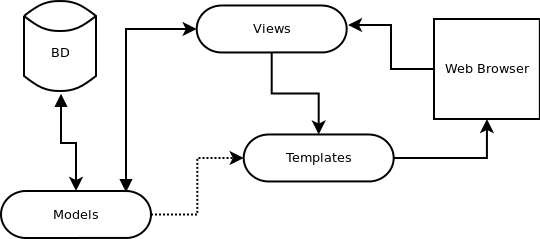

# Django

## ¿Qué es Django?
Django es un framework web de alto nivel desarrollado en Python que fomenta el desarrollo rápido y el diseño limpio y pragmático. Construido por desarrolladores experimentados, se encarga de gran parte de la molestia del desarrollo web, por lo que puede concentrarse en escribir su aplicación sin necesidad de reinventar la rueda. Es gratuito y de código abierto.

## ¿Por qué utilizar Django?
- Es muy rápido: Si tienes una startup, tienes prisa por terminar tu proyecto o, simplemente, quieres reducir costes, con Django puedes construir una aplicación muy buena en poco tiempo. 

- Viene bien cargado: Cualquier cosa que necesites realizar, ya estará implementada, sólo hay que adaptarla a tus necesidades. Ya sea porque hay módulos de la comunidad, por cualquier paquete Python que encuentres o las propias aplicaciones que Django trae, que son muy útiles.

- Es bastante seguro: Podemos estar tranquilos con Django, ya que implementa por defecto algunas medidas de seguridad, las más clásicas, para que no haya SQL Injection, no haya Cross site request forgery (CSRF) o no haya Clickjacking por JavaScript. Django se encarga de manejar todo esto de una manera realmente sencilla.

- Es muy escalable: Podemos pasar desde muy poco a una aplicación enorme perfectamente, una aplicación que sea modular, que funcione rápido y sea estable.

- Es increíblemente versátil: Es cierto que en un principio Django comienza siendo un Framework para almacenar noticias por sitios de prensa, blogs y este estilo de webs, pero con el tiempo ha ganado tanta popularidad que se puede usar para el propósito que gustes.

- Su ORM, su interfaz para acceso a la base de datos, ya que hacer consultas con ella es una maravilla, es una herramienta muy buena.

- Trae de serie un panel de administración, con el cual podemos dejar a personas sin ningún tipo de conocimiento técnico manejando datos importantes de una forma muy cómoda.

 

  

## Patrón MVT

Django sigue el patrón MVT y se separan en Django de la siguiente manera:

- M significa "Model" (Modelo), la capa de acceso a la base de datos. Esta capa contiene toda la información sobre los datos: cómo acceder a estos, cómo validarlos, cuál es el comportamiento que tiene, y las relaciones entre los datos.

- T significa "Template" (Plantilla), la capa de presentación. Esta capa contiene las decisiones relacionadas a la presentación: como algunas cosas son mostradas sobre una página web o otro tipo de documento.

- V significa "View" (Vista), la capa de la lógica de negocios. Esta capa contiene la lógica que accede al modelo y la delega a la plantilla apropiada: puedes pensar en esto como un puente entre el modelos y las plantillas.

Si estás familiarizado con otros frameworks de desarrollo web MVC, como Ruby on Rails o Laravel, quizás consideres que las vistas de Django pueden ser el "controlador" y las plantillas de Django pueden ser la "vista". Esto es una confusión desafortunada a raíz de las diferentes interpretaciones de MVC.

 

  

