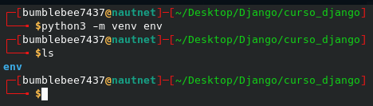
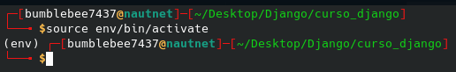
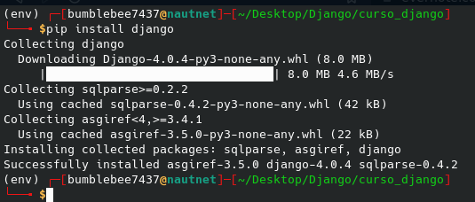
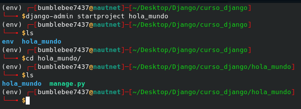
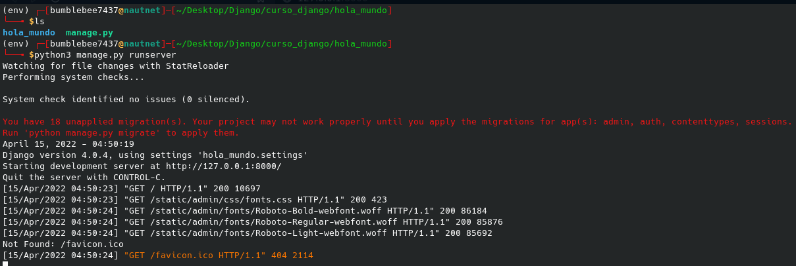
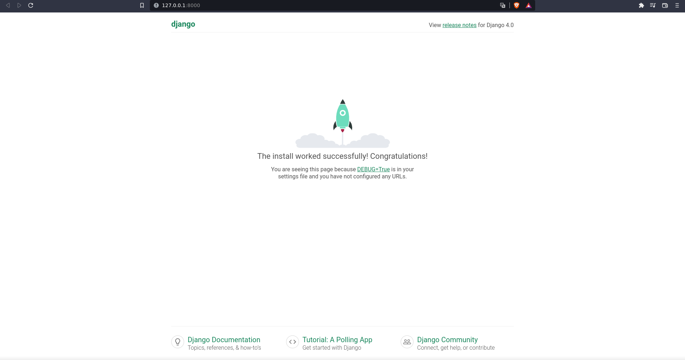

# Configuración de entorno de trabajo

Antes de comenzar el curso debemos conocer como configurar nuestro entorno de trabajo para que todo funcione de manera correcta al iniciar un proyecto. Para esto necesitaremos crear un entorno virtual en Python para nuestro proyecto.

## ¿Qué es un entorno virtual en Python?
Cuando trabajas con varios proyectos en tu máquina (PC, portátil, Mac) hechos en Python, puedes utilizar unos paquetes o librerías externas en uno, otras en otros proyectos o incluso pueden coincidir las mismas librerías, pero por temas compatibilidad debas utilizar una versión en un proyecto y otra versión en otro de tus proyectos.

Para solventar esto la comunidad de Python creo los entornos virtuales. Podríamos decir que es una forma de aislar el entorno de un proyecto de otro y de esta forma cada uno tenga sus propios paquetes o librerías independientes de los demás.

### ¿Cómo crear un entorno virtual en Python?
Desde Python 3, la herramienta para crear entornos virtuales venv viene preinstalada así que si necesitamos crear un entorno virtual, solo debemos ir al directorio raíz de nuestro proyecto y lanzar el siguiente comando si se está trabajando en un entorno Linux:

```
python3 -m venv <nombre-entorno>
```

En caso de estar trabajando en un entorno Windows, lanzar el siguiente comando:
```
python -m venv <nombre-entorno>
```

## Configurando el entorno de trabajo 
Una vez conocida la utilidad de usar los entornos de trabajo en Python, procederemos configurar el entorno de trabajo de nuestro proyecto.

### Creando el entorno virtual
Lo primero que debemos hacer es la creación del entorno virtual de nuestro proyecto.

Como se puede visualizar en la imagen de abajo, se creo el entorno virtual en la carpeta del proyecto con el nombre "env".

<p align="center">
  <a href="" rel="noopener">
 </a>
</p>

Una vez hecho esto, debemos activarlo. Para ello vamos al directorio raíz de nuestro proyecto donde hemos creado el entorno virtual y si estamos en Windows, lo haremos de la siguiente forma:

```
env/Scripts/activate
```

En el caso de usar Linux o Mac, lo haremos de la siguiente manera:
```
source env/bin/activate
```

Y una vez activado el entorno virtual deberíamos ver nuestra línea de comandos de la siguiente manera:

<p align="center">
  <a href="" rel="noopener">
 </a>
</p>

### Instalando Django
El siguiente paso será instalar Django haciendo uso de la herramienta pip que viene preinstalada con Python 3.

Para instalar Django, lo haremos de la siguiente manera:
```
pip install django
```

Y como se muestra en la imagen de abajo podemos ver que la instalación de Django en nuestro entorno virtual fue exitosa.

<p align="center">
  <a href="" rel="noopener">
 </a>
</p>

### Creando nuestro proyecto de Django

Para la creación de nuestro primer proyecto en Django haremos uso de la herramienta django-admin que es la utilidad de línea de comandos de Django para tareas administrativas.

Para crear nuestro proyecto, lo haremos de la siguiente manera:
```
django-admin startproject <nombre-proyecto>
```

Este comando nos creará un directorio que contendrá la aplicación principal del proyecto y el archivo manage.py el cual hace lo mismo que django-admin pero también establece la variable de entorno DJANGO_SETTINGS_MODULE para que apunte al archivo settings.py de nuestro proyecto.

<p align="center">
  <a href="" rel="noopener">
 </a>
</p>

### Verificando que todo está funcionando

Para verificar que el proyecto funciona correctamente, ejecutaremos el siguiente comando dentro de la carpeta del proyecto si estamos en un entorno Linux:
```
python3 manage.py runserver
```

En caso de estar trabajando en un entorno Windows, lanzar el siguiente comando:
```
python manage.py runserver
```

Si todo ha sido exitoso, podremos ver como se ejecuta nuestro proyecto en la ruta http://127.0.0.1:8000/ dentro de nuestro navegador web.

<p align="center">
  <a href="" rel="noopener">
 </a>
</p>

<p align="center">
  <a href="" rel="noopener">
 </a>
</p>