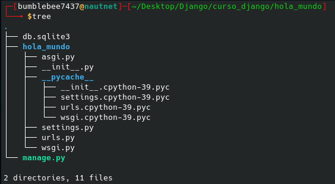

# Conociendo los archivos por defecto en Django

Si fuiste un poco un poco curioso, te pudiste dar cuenta que al momento de iniciar un proyecto en Django contiene varios archivos los cuales conoceremos en esta sección para tener un mejor entendimiento de la razón de su existencia.

Dentro de la carpeta de nuestro proyecto podremos encontrar los siguientes archivos:

- manage.py: Una utilidad de la línea de comandos que le permite interactuar con este proyecto Django de diferentes formas y puedes obtener más información en la [documentación oficial](https://docs.djangoproject.com/en/4.0/ref/django-admin/).
- \_\_init__.py: Un archivo vacío que le indica a Python que este directorio debería ser considerado como un paquete Python.
- settings.py: Ajustes/configuración para este proyecto Django; nos define un conjunto de configuraciones que podemos aplicar sobre el proyecto de manera global.
- urls.py: Las declaraciones URL para este proyecto Django; desde aquí podemos (por ejemplo) cargar más archivos de URLs de otras aplicaciones o dependencias.
- asgi.py: Archivo de entrada para trabajar con servidores ASGI y realizar el deploy.
- wsgi.py: Archivo de entrada para trabajar con servidores WSGI y realizar el deploy.

En la imagen de abajo podemos visualizar el árbol de la carpeta de nuestro proyecto que fue creado anteriormente.

 

  

