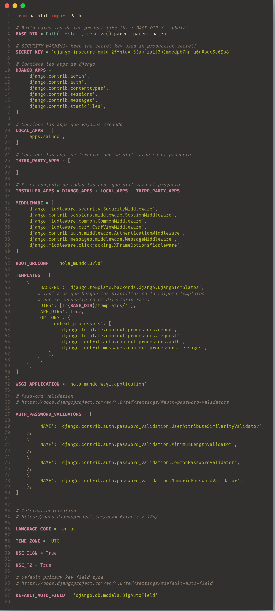

# Organizando el archivo Settings

La organización de las carpetas y los archivos de nuestro proyecto juegan un papel
muy importante para que la interacción de los desarrolladores con el proyecto sea
eficiente y cómoda.

En esta sección organizaremos el archivo settings.py que se encuentra de la siguiente manera y puede separado para manejar las configuraciones que tendremos en local y en producción entre otras cosas:

<br>
<p align="center">
  <a href="" rel="noopener">
 </a>
</p>

## Creación de la carpeta settings
Lo primero que haremos será crear la carpeta settings la cual almacenará nuestros nuevos archivos de configuración del proyecto.

<br>
<p align="center">
  <a href="" rel="noopener">
 </a>
</p>

Lo siguiente será crear 4 archivos dentro de la carpeta settings. Estos archivos se llamarán __\_\_init.py\_\___, __base.py__, __local.py__ y __production.py__

<br>
<p align="center">
  <a href="" rel="noopener">
 </a>
</p>

Primero llenamos el archivo __base.py__ el cual contendrá las configuraciones base tanto para local como para cuando esté en producción nuestro proyecto.

<br>
<p align="center">
  <a href="" rel="noopener">
 </a>
</p>

Y en los archivos __local.py__ y __production.py__ agregaremos las configuraciones que van a depender del entorno en el que se está ejecutando el proyecto tal como se muestra abajo.

<br>
<p align="center">
  <a href="" rel="noopener">
 </a>
</p>

Por último, nos queda indicarle al archivo __manage.py__ cual será nuestro nuevo archivo de configuraciones que ejecutará. Por lo tanto, el archivo __manage.py__ quedará de la siguiente manera.

<br>
<p align="center">
  <a href="" rel="noopener">
 </a>
</p>

Solo nos queda confirmar que todo sigue funcionando de manera correcta haciendo uso del comando para correr el servidor correspondiente a tu sistema operativo:

Windows/MacOs
```
python manage.py runserver
```

Linux
```
python3 manage.py runserver
```

Y como se nos muestra en la imagen de abajo todo funciona de manera correcta y se ejecutan las configuraciones que tenemos para nuestro entorno virtual.

<br>
<p align="center">
  <a href="" rel="noopener">
 </a>
</p>

En este punto, ya puedes eliminar el archivo __settings.py__ que venía por defecto.

