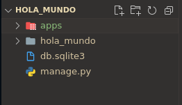
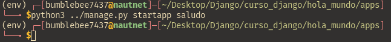

# Creando la primera app en Django
Tal vez te encuentres confundido por el título dado que puedes asumir que todo lo que has hecho anteriormente fue crear y configurar tu primera __app__ en Django, pero temo decirte que los pasos anteriores fueron para crear y configurar un __proyecto__ en Django.

Entonces ¿Cuál es la diferencia entre una __app__ y un __proyecto__? De acuerdo a la documentación de Django: 

"Una app es una aplicación web que hace algo, por ejemplo, un sistema de blog, una base de datos de registros públicos o una aplicación de encuesta simple. Un proyecto es un conjunto de configuraciones y aplicaciones para un sitio web determinado. Un proyecto puede contener aplicaciones múltiples. Una aplicación puede estar en varios proyectos."

Cada aplicación que usted escribe en Django consiste en un paquete de Python que sigue una determinada convención. Django tiene una utilidad que genera automáticamente la estructura básica de directorios de una aplicación, por lo que usted puede centrarse en la escritura de código en lugar de crear directorios.

<br>
<p align="center">
  <a href="" rel="noopener">
 </a>
</p>

## Creando la app saludo en nuestro proyecto
Ahora que ya tienes contexto de lo que son las apps y la utilidad que tienen, crearemos nuestra app saludo la cual se encargará de mostrar una pantalla de bienvenida a nuestro usuario.

Lo primero que haremos será crear una carpeta en nuestro proyecto llamada "apps", en la cual se guardarán todas las apps que se vayan a crear para ese proyecto, con la intención de tener un mejor control en nuestro proyecto.

<br>
<p align="center">
  <a href="" rel="noopener">
 </a>
</p>

Lo siguiente será abrir una terminal ubicada en la carpeta de nuestro proyecto y dirigirnos a la carpeta que creamos para almacenar nuestras apps.

<br>
<p align="center">
  <a href="" rel="noopener">
 </a>
</p>

Ahora procedemos a crear nuestra app haciendo uso del siguiente comando:
Windows/MacOs:
```
python ..\manage.py startapp <nombre-app>
```

Linux
```
python ../manage.py startapp <nombre-app>
```

En este caso llamaremos "saludo" a nuestra app.

<br>
<p align="center">
  <a href="" rel="noopener">
 </a>
</p>

Y después de un tiempo veremos que django ha creado los directorios y archivos necesarios para hacer uso de nuestra app.

<br>
<p align="center">
  <a href="" rel="noopener">
 </a>
</p>

Para completar la creación de nuestra app debemos notificarle a nuestro proyecto que hemos agregado una nueva aplicación y que la debe de tomar en cuenta. Esto lo lograremos registrando nuestra app en las __LOCAL_APPS__ de nuestro archivo __base.py__ en la carpeta settings que creamos anteriormente.

## Integrando la app a __base.py__
Debido a que la ubicación por defecto de las aplicaciones se ha modificado debido a la creación del directorio "apps" que creamos lo que haremos será modificar el archivo __apps.py__ que se creó junto con la app "saludo" para modificar el nombre con el que se identificará esta aplicación. 

En la imagen de abajo podemos ver como debería de lucir nuestro archivo __apps.py__:

<br>
<p align="center">
  <a href="" rel="noopener">
 </a>
</p>

Ahora procedemos a agregar nuestra app en __LOCAL_APPS__ del archivo __base.py__:

<br>
<p align="center">
  <a href="" rel="noopener">
 </a>
</p>

Si todo fue hecho correctamente podemos echar a andar el servidor sin ningún problema.

<br>
<p align="center">
  <a href="" rel="noopener">
 </a>
</p>