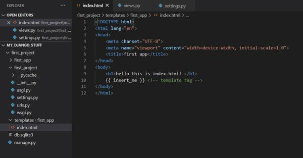

# Templates (Plantillas) en Django
Al ser un framework web, Django necesita una forma conveniente de generar HTML dinámicamente. El enfoque más común se basa en plantillas. Una plantilla contiene las partes estáticas de la salida HTML deseada, así como una sintaxis especial que describe cómo se insertará el contenido dinámico.

Un proyecto de Django se puede configurar con uno o varios motores de plantillas (o incluso cero si no usa plantillas). Django envía backends incorporados para su propio sistema de plantillas, llamado creativamente el lenguaje de plantillas de Django (DTL), y para la popular alternativa Jinja2. Los backends para otros idiomas de plantilla pueden estar disponibles de terceros.

## Lenguaje de plantillas de Django
Una plantilla Django es un documento de texto o una cadena de Python marcada utilizando el lenguaje de plantilla Django. Algunas construcciones son reconocidas e interpretadas por el motor de plantillas. Las principales son las variables y las etiquetas. Una plantilla se representa con un contexto. La representación reemplaza las variables con sus valores, que se buscan en el contexto, y ejecuta las etiquetas. Todo lo demás es salida tal cual. 
La sintaxis del lenguaje de plantillas Django implica cuatro construcciones.

### Variables
Una variable genera un valor del contexto, que es un objeto similar a un dictado que asigna claves a valores. 

Las variables están rodeadas por {{ y }} de esta manera:
```
My first name is {{ first_name }}. My last name is {{ last_name }}.
```

Con un contexto de {'first_name': 'John', 'last_name': 'Doe'}, esta plantilla se representa en:
```
My first name is John. My last name is Doe.
```

La búsqueda de diccionarios, la búsqueda de atributos y las búsquedas de índice de lista se implementan con una notación de puntos:

```
{{ my_dict.key }}
{{ my_object.attribute }}
{{ my_list.0 }}
```

### Tags
Las etiquetas proporcionan lógica arbitraria en el proceso de representación. Esta definición es deliberadamente vaga. Por ejemplo, una etiqueta puede generar contenido, servir como estructura de control, por ejemplo, una instrucción «if» o un bucle «for», capturar contenido de una base de datos o incluso permitir el acceso a otras etiquetas de plantilla. 

Las etiquetas están rodeadas por  de esta manera:
```

```

La mayoría de las etiquetas aceptan argumentos:
```

```

Algunas etiquetas requieren un inicio y fin:
```

    <p>Number of athletes: {{ athlete_list|length }}</p>

    <p>Athletes should be out of the locker room soon!</p>

    <p>No athletes.</p>

```

```

    <li>{{ student.first_name}}  {{ student.last_name }}</li>

        <li>Lo sentimos, no hay alumnos registrados.</li>

```

Un tag que nos va a ser útil para heredar de una template base va a ser la siguiente:
```

```

También podemos crear bloques de templates que pueden ser sobreescritos en las templates hijas con el uso del block tag:
```

    {# Aquí va a ir el main del HTML de nuestro hijo #}

```


Puedes encontrar más información acerca de los tags [aquí](https://docs.djangoproject.com/es/4.0/ref/templates/builtins/#ref-templates-builtins-tags)

### Filtros
Los filtros transforman los valores de las variables y los argumentos de etiqueta. Se ven así:
```
{{ django|title }}
```

Con un contexto de {'django': 'the web framework for perfectionists with deadlines'}, esta plantilla se traduce en:

```
The Web Framework For Perfectionists With Deadlines
```

Algunos filtros necesitan argumentos para funcionas, por ejemplo:
```
{{ my_date|date:"Y-m-d" }}
```
Puedes encontrar más información acerca de los filtros [aquí](https://docs.djangoproject.com/es/4.0/ref/templates/builtins/#ref-templates-builtins-filters)


### Comentarios
Los comentarios lucen de la siguiente manera:
```
{# this won't be rendered #}
```

Para realizar comentarios multilínea se hará haciendo uso del comment tag de la siguiente manera:
```
<p>Rendered text with {{ pub_date|date:"c" }}</p>

    <p>Commented out text with {{ create_date|date:"c" }}</p>

```
Cabe recalcar que los comment tags no deben anidarse.

<br>
<p align="center">
  <a href="" rel="noopener">
 </a>
</p>
