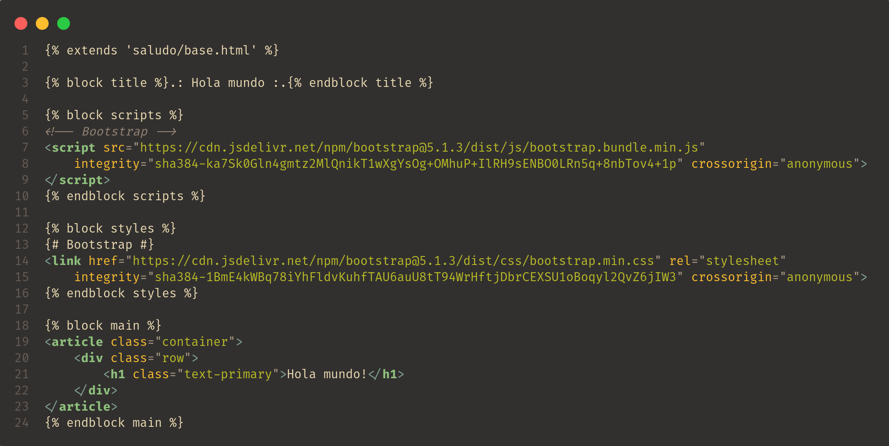

# Configurando proyecto para el uso de templates
Ahora que tienes un concepto básico de los que son las templates y como funcionan, vamos a realizar algunas configuraciones para que las templates de nuestras aplicaciones se encuentren en una carpeta dedicada al almacenamiento de templates como lo hicimos con nuestras apps.

## Configurando el proyecto para el uso de templates
Primero crearemos una carpeta llamada templates en la carpeta raíz del proyecto.

<br>
<p align="center">
  <a href="" rel="noopener">
 </a>
</p>

Ahora le indicaremos al proyecto en qué carpeta es donde va a buscar las templates que creemos en nuestro proyecto. Esto se lo indicaremos en el archivo __base.py__ en la sección de templates quedando de esta manera:

<br>
<p align="center">
  <a href="" rel="noopener">
 </a>
</p>

## Creando la template __base.html__
Ahora comenzaremos a hacer nuestras propias templates para realizar nuestro hola mundo en Django. Para tener organización de las templates de cada aplicación crearemos una carpeta con el nombre de la aplicación a la que pertenecerán las templates que estén almacenadas en esa carpeta.

<br>
<p align="center">
  <a href="" rel="noopener">
 </a>
</p>

Una vez que hemos creado la carpeta que contendrá las templates de nuetra app "saludo", procederemos a crear la plantilla base para nuestra app. La estructura del nombre de nuestras platilla será la siguiente:
```
<nombre-plantila>.html
```
<br>
<p align="center">
  <a href="" rel="noopener">
 </a>
</p>

Dentro de este archivo HTML podemos crear nuestra plantilla y hacer uso de HTML y del DTL que se mencionó anteriormente.

En la imagen de abajo podemos ver el contenido de nuestro archivo __base.html__ el cual será heredado de las otras templates para no repetir estructura HTML y solo sobreescribir los block tags en las templates hijas.

<br>
<p align="center">
  <a href="" rel="noopener">
 </a>
</p>

## Heredando la template __base.html__ en la template __hola_mundo.html__
Ahora crearemos una template de nuestra app "hola_mundo" que se encargará de mostrar el mensaje "Hola mundo", pero en vez de escribir toda la estructura HTML lo que haremos será heredar de la template __base.html__ y vamos a sobreescribir los bloques que se encuentran en esta.

En la imagen de abajo podemos apreciar como es que quedó nuestra template __hola_mundo.html__. Te darás cuenta que ya se tuvo que escribir de nuevo toda la estructura HTML y solo sobreescribimos los bloques que se encuentran en nuestra template __base.html__.

<br>
<p align="center">
  <a href="" rel="noopener">
 </a>
</p>