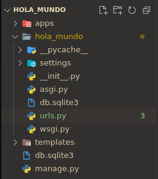
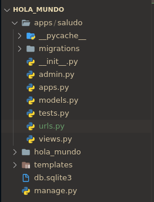
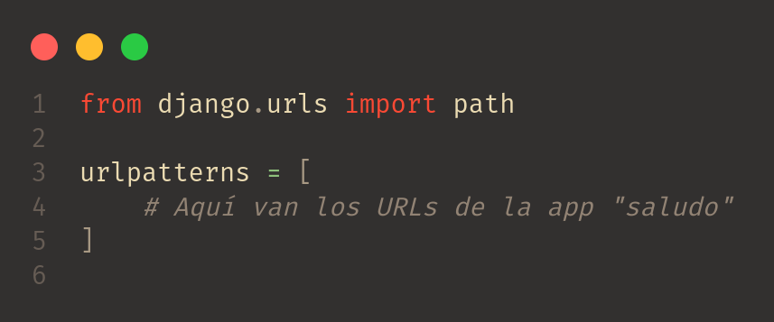
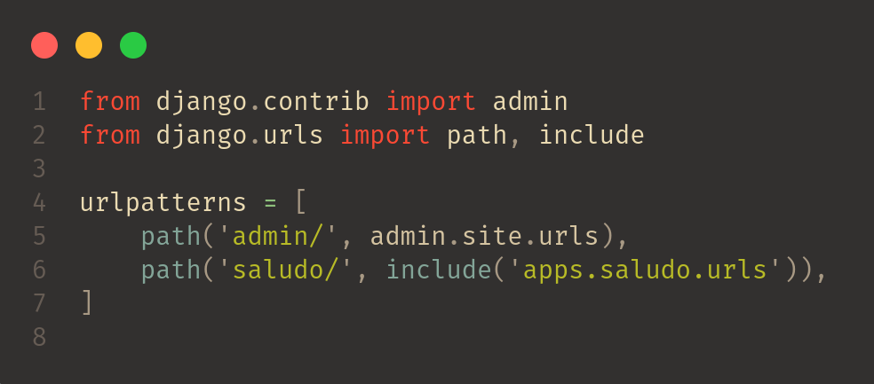

# URLs en Django
Una URL es una dirección de la web. Puedes ver una URL cada vez que visitas una página. Se ve en la barra de direcciones del navegador. (¡Sí! __localhost:8000__ es una URL).

Cada página en Internet necesita su propia URL. De esta manera tu aplicación sabe lo que debe mostrar a un usuario que abre una URL. En Django utilizamos algo que se llama URLconf (configuración de URL). URLconf es un conjunto de patrones que Django intentará comparar con la URL recibida para encontrar la vista correcta.

Por lo tanto, cada app debe de tener sus propias URLs que correspondan a las vistas de esa app, pero ¿Dónde se configuran esas URLs en nuestras apps?

# Configurando URLs de nuestra app "saludo"
Si fuiste curioso al momento de que fuimos creando nuestro proyecto, te diste cuenta que en la carpeta de archivos de configuración del proyecto existe un archivo llamado __urls.py__.

<br>
<p align="center">
  <a href="" rel="noopener">
 </a>
</p>

Este archivo es el encargado de administrar las URLs de nuestro proyecto que se encargarán de "llamar" la vista que le corresponda a ese URLs.

Entonces... ¿Cómo "enganchamos" las vistas de mis apps a URLs?
En el archivo __urls.py__ nos proporciona 3 maneras de hacerlo:
```
Function views
    1. Importamos el archivo de las vistas de la app:  from my_app import views
    2. Enganchamos la vista con una URL:  path('', views.home, name='home')
Class-based views
    1. Importamos la vista en específico:  from other_app.views import Home
    2. Enganchamos la vista con una URL:  path('', Home.as_view(), name='home')
Incluir un otro archivo URLconf
    1. Importamos la función include(): from django.urls import include, path
    2. Enganchamos el archivo con una URL:  path('blog/', include('blog.urls'))
```

__Nota__: Como puedes visualizar en el texto de arriba siempre que se use una vista basada en clases deberas utilizar el método __as_view()__.  
```
path('<URL>', <nombre-vista>.as_view(), name='<alias>')
```

En nuestro caso usaremos un archivo de URLs para cada aplicación para llevar un control y tener nuestro archivo __urls.py__ "principal" limpio.

Lo primero que haremos es crearle a nuestra app "saludo" su propio archivo __urls.py__.

<br>
<p align="center">
  <a href="" rel="noopener">
 </a>
</p>

Y ese archivo __urls.py__ que creamos va a contener los siguiente:

<br>
<p align="center">
  <a href="" rel="noopener">
 </a>
</p>

Ahora lo que nos falta es incluir ese archivo __urls.py__ de la app "saludo" en nuestro archivo __urls.py__ "principal".

<br>
<p align="center">
  <a href="" rel="noopener">
 </a>
</p>
