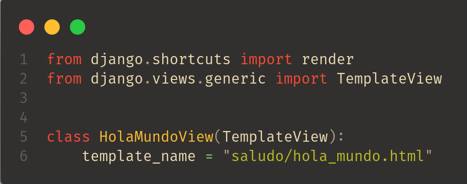
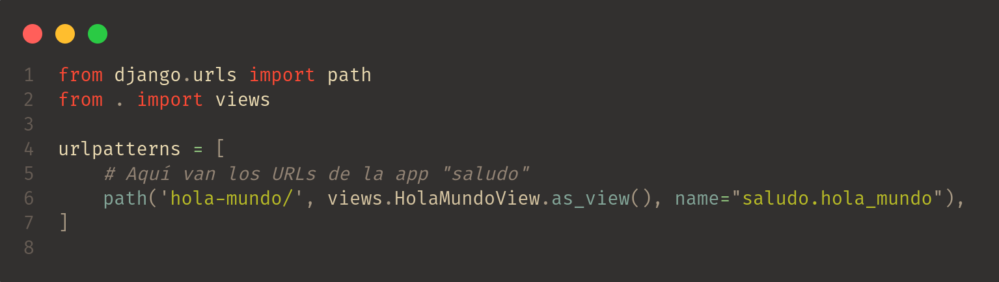
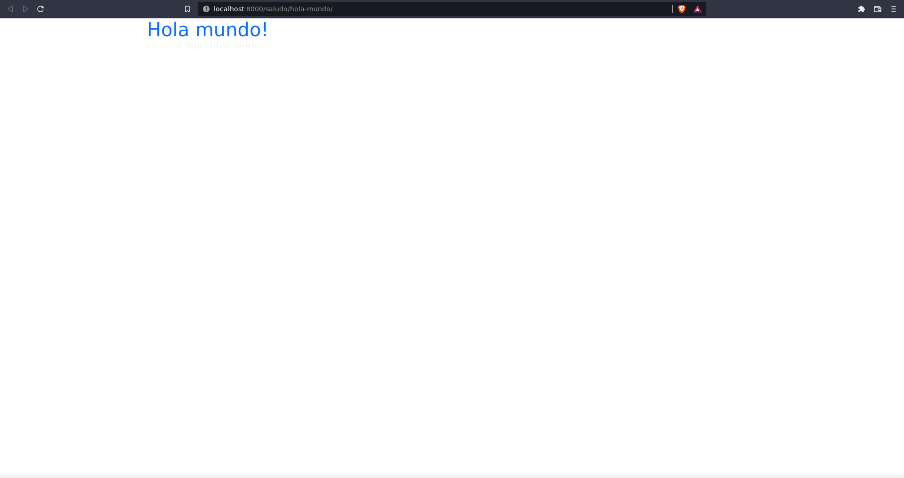

# ¡Hola mundo!
Hemos llegado al final de esta sección introductoria de Django que tiene como objetivo que 
realices tu hola mundo en Django con un proyecto configurado de manera ordenada para que 
tengas la nociones de como configurar tus próximos proyectos.

Con todo lo que hemos hecho a través de esta sección hemos dejado listo el terreno para solo
crear una vista que se va a encargar de renderizar las templates que creamos y "enganchar" esa
vista a un URL.

## Creando la vista HolaMundoView
Lo primero que haremos es crear nuestra Vista encargada de renderizar nuestra template. 
Haremos uso de la Vista basada en clases __TemplateView__ para lograr este objetivo.

De esta manera debe de lucir nuestra vista en el archivo __views.py__ de nuestra app "saludo":

<br>
<p align="center">
  <a href="" rel="noopener">
 </a>
</p>


El siguiente paso será "enganchar" esta vista a un URL dentro del archivo __urls.py__ ubicado en nuestra app "saludo".

<br>
<p align="center">
  <a href="" rel="noopener">
 </a>
</p>

Lo último que queda por hacer es levantar el servidor y visitar la URL
```
http://localhost:8000/saludo/hola-mundo
```

Como podemos ver se nos muestra de forma correcta el template que le indicamos a la vista:

<br>
<p align="center">
  <a href="" rel="noopener">
 </a>
</p>