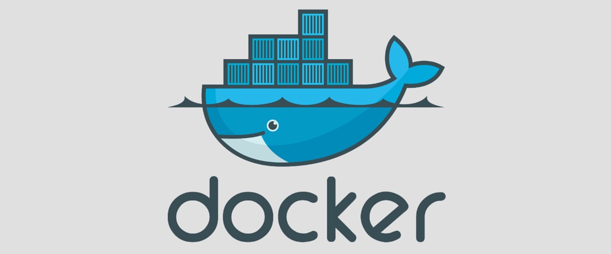
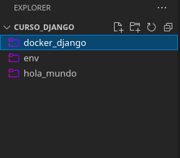
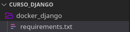
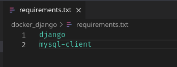
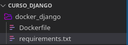
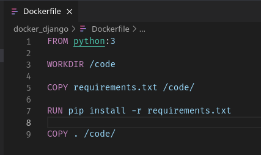
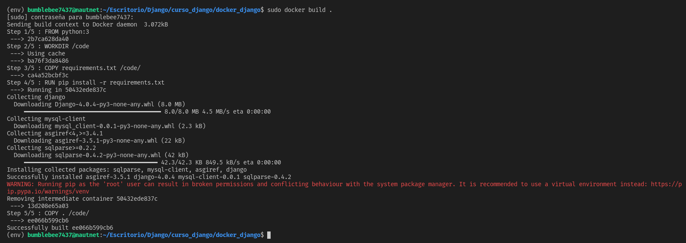
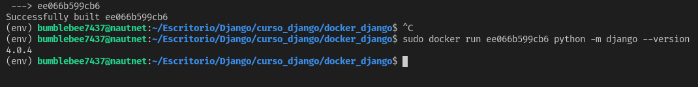
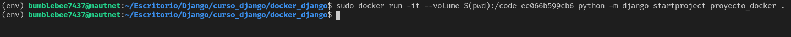
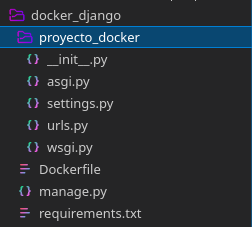

# Docker y Django

En las secciones anteriores se realizó la creación y configuración de un proyecto de Django de 
manera genérica. En esta ocasión se explicará el proceso para iniciar un proyecto de Django haciendo 
uso de Docker.

# ¿Qué es Docker?
Docker es una plataforma de contenerización de código abierto. Permite a los desarrolladores empaquetar aplicaciones en contenedores: componentes ejecutables estandarizados que combinan el código fuente de la aplicación con las bibliotecas del sistema operativo (SO) y las dependencias necesarias para ejecutar dicho código en cualquier entorno. Los contenedores simplifican la entrega de aplicaciones distribuidas y se han vuelto cada vez más populares a medida que las organizaciones cambian al desarrollo nativo de la nube y entornos híbridos multinube.

Los desarrolladores pueden crear contenedores sin Docker, pero la plataforma permite crear, implementar y gestionar contenedores de forma más fácil, sencilla y segura. Docker es esencialmente un kit de herramientas que permite a los desarrolladores crear, implementar, ejecutar, actualizar y detener contenedores utilizando comandos simples y automatización que ahorra trabajo a través de una única API.

<br>
<p align="center">
  <a href="" rel="noopener">
 </a>
</p>

# Iniciando proyecto de Django con Docker

## Requerimientos
- docker
- docker compose

### Instrucciones

- Crear un directorio en el que se va a echar a andar
el proyecto de Django

<br>
<p align="center">
  <a href="" rel="noopener">
 </a>
</p>

- Instalar las imágenes de Docker necesarias para el proyecto
    - [Python](https://hub.docker.com/_/python)
    - [MySQL](https://hub.docker.com/_/mysql)  

- Dentro del directorio del proyecto crearemos un archivo llamado __requirements.txt__, el cual contendrá las dependencias que se utilizarán en nuestro proyecto.

<br>
<p align="center">
  <a href="" rel="noopener">
 </a>
</p>

- Dentro del archivo __requirements.txt__ escribir las dependencias del proyecto.

<br>
<p align="center">
  <a href="" rel="noopener">
 </a>
</p>

- Dentro del directorio del proyecto crear el archivo __Dockerfile__ en el cual se introducirán las instrucciones necesarias para crear la imagen local de nuestro proyecto.

<br>
<p align="center">
  <a href="" rel="noopener">
 </a>
</p>

- Introducimos las instrucciones necesarias para la imagen local
    - Definimos la imagen base
    ```
        FROM python:3
    ```
    - Creamos nuestro directorio de trabajo
    ```
        WORKDIR /code
    ```
    - Ahora necesitaremos instalar Django y el cliente de mysql para Python, en este paso usaremos el archivo de requirements
    ```
        COPY requirements.txt /code/
    ```
    - En este punto podemos instalar las dependencias con la siguiente instrucción
    ```
        RUN pip install -r requirements.txt
    ```
    - Y poner una copia de nuestro código en la carpeta en la que nos encontramos dentro de nuestro directorio de trabajo en el contenedor de Docker
    ```
        COPY . /code/
    ```

Al final el archivo __Dockerfile__ debe lucir de la siguiente manera:

<br>
<p align="center">
  <a href="" rel="noopener">
 </a>
</p>

- Con el siguiente comando en la terminal podemos comprobar que nuestra imagen se puede procesar correctamente
```
    docker build .
```

<br>
<p align="center">
  <a href="" rel="noopener">
 </a>
</p>

- Comprobamos que la imagen fue creada correctamente consultando la versión de Django que tiene instalada haciendo uso del siguiente comando:

```
    docker run <id-imagen> python -m django --version
```

<br>
<p align="center">
  <a href="" rel="noopener">
 </a>
</p>

- Crear el proyecto de Django en el contenedor que hemos creado anteriormente haciendo uso del siguiente comando:

Linux
```
    docker run -it --volume $(pwd):/code <id-Imagen> python -m django startproject <nombre-proyecto> .
```

Windows
```
    docker run -it --volume %cd%:/code <id-imagen> python -m django startproject <nombre-proyecto> .
```

<br>
<p align="center">
  <a href="" rel="noopener">
 </a>
</p>

<br>
<p align="center">
  <a href="" rel="noopener">
 </a>
</p>