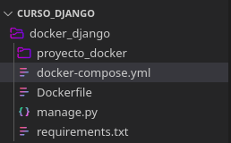

# Docker y Django

En las secciones anteriores se realizó la creación y configuración de un proyecto de Django de 
manera genérica. En esta ocasión se explicará el proceso para iniciar un proyecto de Django haciendo 
uso de Docker.

# ¿Qué es Docker?
Docker es una plataforma de contenerización de código abierto. Permite a los desarrolladores empaquetar aplicaciones en contenedores: componentes ejecutables estandarizados que combinan el código fuente de la aplicación con las bibliotecas del sistema operativo (SO) y las dependencias necesarias para ejecutar dicho código en cualquier entorno. Los contenedores simplifican la entrega de aplicaciones distribuidas y se han vuelto cada vez más populares a medida que las organizaciones cambian al desarrollo nativo de la nube y entornos híbridos multinube.

Los desarrolladores pueden crear contenedores sin Docker, pero la plataforma permite crear, implementar y gestionar contenedores de forma más fácil, sencilla y segura. Docker es esencialmente un kit de herramientas que permite a los desarrolladores crear, implementar, ejecutar, actualizar y detener contenedores utilizando comandos simples y automatización que ahorra trabajo a través de una única API.

<br>
<p align="center">
  <a href="" rel="noopener">
 </a>
</p>

# Iniciando proyecto de Django con Docker

## Requerimientos
- docker
- docker compose

### Instrucciones

- Crear un directorio en el que se va a echar a andar
el proyecto de Django

<br>
<p align="center">
  <a href="" rel="noopener">
 </a>
</p>

- Instalar las imágenes de Docker necesarias para el proyecto
    - [Python](https://hub.docker.com/_/python)
    - [MySQL](https://hub.docker.com/_/mysql)  

- Dentro del directorio del proyecto crearemos un archivo llamado __requirements.txt__, el cual contendrá las dependencias que se utilizarán en nuestro proyecto.

<br>
<p align="center">
  <a href="" rel="noopener">
 </a>
</p>

- Dentro del archivo __requirements.txt__ escribir las dependencias del proyecto.

<br>
<p align="center">
  <a href="" rel="noopener">
 </a>
</p>

- Dentro del directorio del proyecto crear el archivo __Dockerfile__ en el cual se introducirán las instrucciones necesarias para crear la imagen local de nuestro proyecto.

<br>
<p align="center">
  <a href="" rel="noopener">
 </a>
</p>

- Introducimos las instrucciones necesarias para la imagen local
    - Definimos la imagen base
    ```
        FROM python:3
    ```
    - Creamos nuestro directorio de trabajo
    ```
        WORKDIR /code
    ```
    - Ahora necesitaremos instalar Django y el cliente de mysql para Python, en este paso usaremos el archivo de requirements
    ```
        COPY requirements.txt /code/
    ```
    - En este punto podemos instalar las dependencias con la siguiente instrucción
    ```
        RUN pip install -r requirements.txt
    ```
    - Y poner una copia de nuestro código en la carpeta en la que nos encontramos dentro de nuestro directorio de trabajo en el contenedor de Docker
    ```
        COPY . /code/
    ```

Al final el archivo __Dockerfile__ debe lucir de la siguiente manera:

<br>
<p align="center">
  <a href="" rel="noopener">
 </a>
</p>

- Con el siguiente comando en la terminal podemos comprobar que nuestra imagen se puede procesar correctamente
```
    docker build .
```

<br>
<p align="center">
  <a href="" rel="noopener">
 </a>
</p>

- Comprobamos que la imagen fue creada correctamente consultando la versión de Django que tiene instalada haciendo uso del siguiente comando:

```
    docker run <id-imagen> python -m django --version
```

<br>
<p align="center">
  <a href="" rel="noopener">
 </a>
</p>

- Crear el proyecto de Django en el contenedor que hemos creado anteriormente haciendo uso del siguiente comando:

Linux
```
    docker run -it --volume $(pwd):/code <id-Imagen> python -m django startproject <nombre-proyecto> .
```

Windows
```
    docker run -it --volume %cd%:/code <id-imagen> python -m django startproject <nombre-proyecto> .
```

<br>
<p align="center">
  <a href="" rel="noopener">
 </a>
</p>

<br>
<p align="center">
  <a href="" rel="noopener">
 </a>
</p>

Con esto hemos creado el proyecto de Django con Docker y podríamos organizar nuestro entorno de trabajo como se hizo previamente.

## ¿Qué es Docker Compose?
Compose para Docker es una herramienta que nos permite definir y correr aplicaciones con multi contenedores, una vez definida la configuración mediante el comando docker-compose y sus parámetros podemos crear y lanzar las aplicaciones de forma conjunta y con una línea de comandos.

Además Compose nos permite trabajar con diferentes entornos como Production, Staging, Development y Testing, permitiendo crear un entorno de integración continua.

La configuración de Compose se realiza en un fichero con formato YAML, con la extensión yml, es decir, todos nuestros ficheros de configuración se denominarán: __docker-compose.yml__

### Configurando el entorno del proyecto con Docker Compose

Como se mencionó anteriormente Docker compose nos ayudará a tener una gestión más limpia de nuestro proyecto y para ello necesitaremos crear el archivo __docker-compose.yml__, el cual contenerá la configuración del entorno del proyecto.

<br>
<p align="center">
  <a href="" rel="noopener">
 </a>
</p>

### Llenando el archivo __docker-compose.yml__

- Primero definiremos la versión de docker compose que vamos a utilizar

```
version: '2.5.0'
```

- Después definimos los servicios que vamos a usar, en primer lugar nuestro servidor web.
```
web:
    container_name: ${PROJECT_NAME}_web
    build: .
    working_dir: /code
    command: python manage.py runserver 0.0.0.0:8000
    volumes:
      - .:/code
    ports:
      - '8085:8000'
    expose:
      - '8000'
    links:
      - mysql
    networks:
      backend:
        ipv4_address: 192.20.0.5
    tty: true
```

Explicando un poco la definición de este servicio vamos a poner como nombre del contenedor el nombre del proyecto mas la terminación _web. El contenedor se va a generar desde el contexto del mismo directorio en el cual se encuentra nuestra imagen en __Dockerfile__. El directorio de trabajo será __/code__ y el comando que se estará ejecutando el cual va a ser:

```
command: python manage.py runserver 0.0.0.0:8000
```

Este comando iniciará el servidor de test que proveé Django, este sera el comando que se estará ejecutando en el ciclo de vida del contenedor. Después con volumes vamos a pedir a Docker compose que cree una copia de nuestro directorio dentro del directorio de trabajo del contenedor y esto nos servirá para la ejecución del código en el contenedor.

Con ports le indicaremos el mapa de puertos de nuestro host y el contenedor, en este caso mapeamos el puerto 8085 de nuestro host al puerto 8000 del contenedor y el cual es usado para el servidor.

La instrucción expose nos permite agregar metadata que para saber en que puerto se estará publicando la aplicación.

La instrucción links nos permite ligar a otro servicio el que se esta definiendo, en otras palabras nos permite definir que el servicio web va a interactuar con mysql.

La instrucción networks define la red por la cual se comunicaran los diferentes servicios. En esta parte especificamos una dirección ip fija.

Finalmente tty nos permite que el contenedor se mantenga corriendo de manera correcta.

Ahora podemos añadir el servicio de mysql para nuestra base de datos.

```
mysql:
    container_name: ${PROJECT_NAME}_db
    image: 'mysql'
    volumes:
      - './database/data:/var/lib/mysql'
    ports:
      - '3308:3306'
    networks:
      backend:
        ipv4_address: 192.20.0.6
    environment:
      MYSQL_DATABASE: project
      MYSQL_ROOT_PASSWORD: password
```

Aquí definimos el nombre del contenedor, que usa la imagen mysql y que estará montando un volume de la carpeta __./database/data__ en __/var/lib/mysql__ este paso nos permitirá mantener la base de datos que se cree en el contenedor de mysql y asi no tendremos que definir la base de datos cada que iniciamos los servicios. Mapeamos el puerto 3308 al 3306 que usa mysql en el contenedor y definimos la red a la que estará conectada con su respectiva ip. Finalmente para el contenedor de mysql podemos definir dos variables de entorno __MYSQL_DATABASE__ nos permite definir la base de datos que se creara cuando el servicio inicie y ademas __MYSQL_ROOT_PASSWORD__ que define la contraseña del usuario root.

Como ultimo con docker-compose definimos la red backend que se uso en los servicios anteriores. La red backend usara el driver bridge y una configuración donde las direcciones ip tendrán una mascara de 24 y empezaran con 192.20.0.
```
networks:
  backend:
    driver: bridge
    ipam:
      config:
        - subnet: 192.20.0.0/24
```

<br>
<p align="center">
  <a href="" rel="noopener">
 </a>
</p>

Necesitamos definir nuestra variable de entorno para el nombre del proyecto. Para esto creamos un archivo .env en nuestro directorio de trabajo el cual tiene que contener lo siguiente:
```
###< docker ###
PROJECT_NAME=docker_python
###> docker ###
```

<br>
<p align="center">
  <a href="" rel="noopener">
 </a>
</p>

<br>
<p align="center">
  <a href="" rel="noopener">
 </a>
</p>

Para comprobar que todo funciona correctamente iniciando los servicios con el comando:
```
docker compose up -d
```

<br>
<p align="center">
  <a href="" rel="noopener">
 </a>
</p>

Si todo esta correcto al ir a nuestro navegador e introducir [localhost:8085](localhost:8085) podremos ver una pantalla como la siguiente:

<br>
<p align="center">
  <a href="" rel="noopener">
 </a>
</p>

Como ultimo podemos correr las migraciones en la base de datos, estas migraciones serán las migraciones del módulo admin de Django, para este paso podremos usar el siguiente comando:
```
docker exec -it docker_python_web bash
```

<br>
<p align="center">
  <a href="" rel="noopener">
 </a>
</p>


Para bajar los servicos utilizamos el comando:
```
docker compose down 
```

<br>
<p align="center">
  <a href="" rel="noopener">
 </a>
</p>

Con esto podemos hacer uso de Django con Docker para nuestros futuros proyectos.