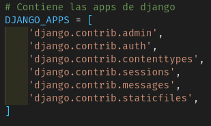
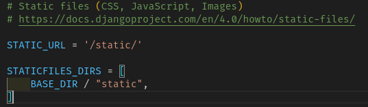
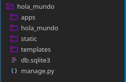
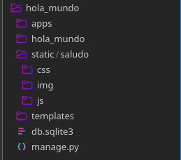
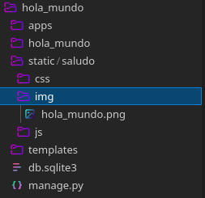
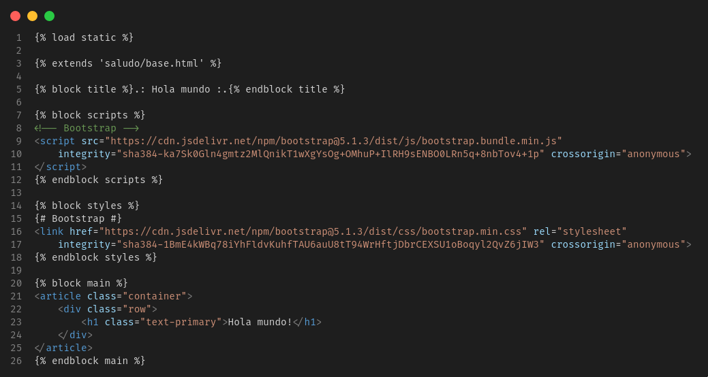
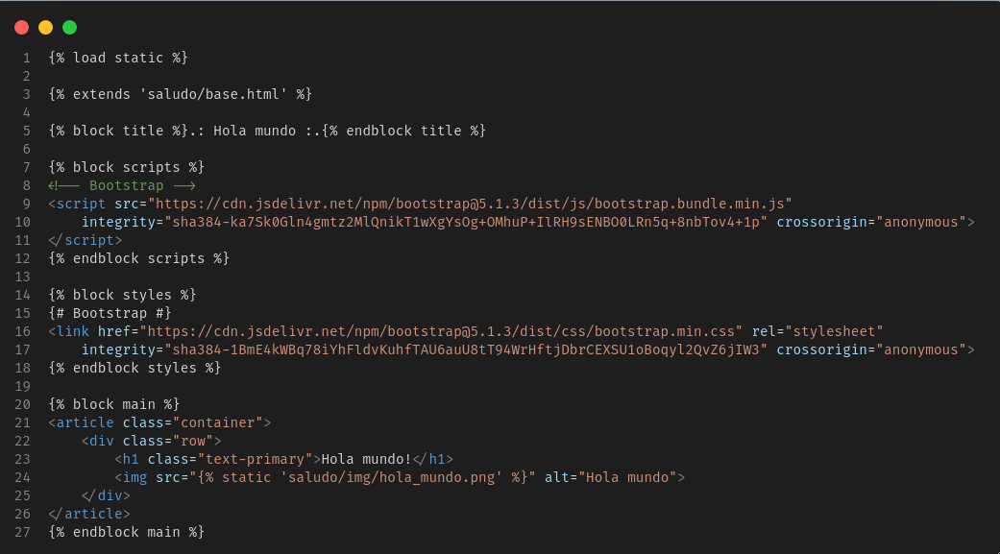
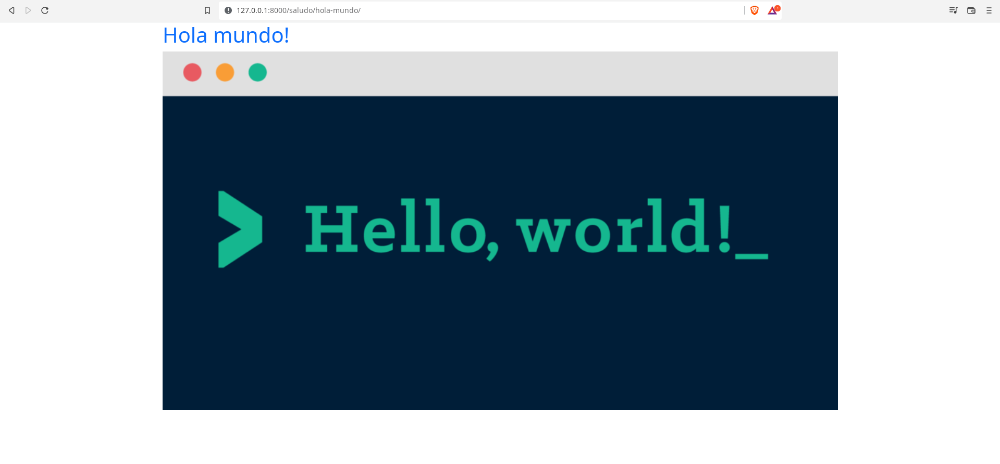

# Archivos estáticos (Static files)

Los sitios web generalmente necesitan servir archivos adicionales como imágenes, JavaScript o CSS. En Django, nos referimos a estos archivos como "archivos estáticos". Django proporciona __django.contrib.staticfiles__ para ayudarlo a administrarlos.

# Configuración de los archivos estáticos

Haremos la configuración del directorio de los archivos estáticos en el proyecto que hemos venido trabajando en esta sección (El que no fue iniciado en Docker).

- Asegúrate que __django.contrib.staticfiles__ se encuentre en DJANGO_APPS en el archivo __base.py__

<br>
<p align="center">
  <a href="" rel="noopener">
 </a>
</p>

- En el archivo de configuración __local.txt__, define la variable STATIC_URL y define el directorio en el que se van a buscar los archivos estáticos de la siguiente manera:

```
STATIC_URL = '/static/'

STATICFILES_DIRS = [
    BASE_DIR / "static",
]
```

<br>
<p align="center">
  <a href="" rel="noopener">
 </a>
</p>

- Crear un directorio llamado __static__ en la directorio raíz del proyecto donde se almacenarán los archivos estáticos

<br>
<p align="center">
  <a href="" rel="noopener">
 </a>
</p>

Con estos pasos hemos configurado de manera exitosa el uso de archivos estáticos dentro de nuestra aplicación de Django. Cabe recalcar que este proceso es solo utilizado en ambiente de __desarrollo__ debido a que no es muy seguro en un ambiente de __producción__.

Para conocer más acerca de __static files__ y como servirlos en un ambiente de producción visita la [documentación](https://docs.djangoproject.com/es/4.0/howto/static-files/).

# Agregando una imagen a nuestra template de hola mundo

- Para tener un control de los archivos estáticos de cada una de las apps de nuestros proyectos, lo que haremos es crear un directorio dedicado a cada app dentro del directorio __static__. Y dentro de ese directorio de la app crearemos un directorio dedicado a almacenar estilos CSS, Scripts de JS y las imágenes que serán utilizadas por esa app.

<br>
<p align="center">
  <a href="" rel="noopener">
 </a>
</p>

- Dentro de la carpeta de imágenes guardamos la imagen que será mostrada en nuestra template del hola mundo

<br>
<p align="center">
  <a href="" rel="noopener">
 </a>
</p>

- Dentro del template hola_mundo.html utilizamos el tag para cargar los archivos estáticos y poder hacer uso de ellos en esa template.

El tag para cargar los archivos estáticos es el siguiente:

```

```

<br>
<p align="center">
  <a href="" rel="noopener">
 </a>
</p>


- Ahora procedemos a cargar la imagen en nuestra template para que sea mostrada

<br>
<p align="center">
  <a href="" rel="noopener">
 </a>
</p>

- Para confirmar que nuestros archivos estáticos están siendo consumidos de manera correcta lo que haremos es levantar el servidor y visitar el enlace del template hola mundo para confirmar que la imagen que guardamos está siendo mostrada de manera correcta.

<br>
<p align="center">
  <a href="" rel="noopener">
 </a>
</p>

Como podemos observar en la imagen de arriba la imagen se cargó de manera correcta en nuestro template.